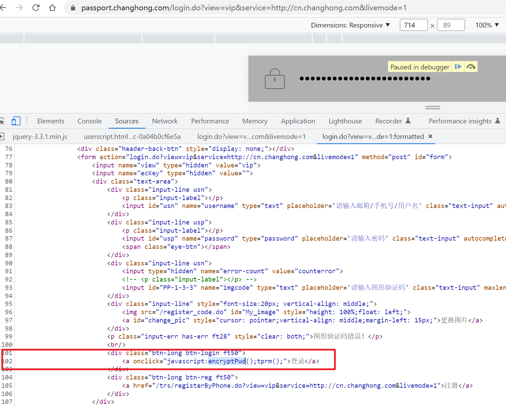
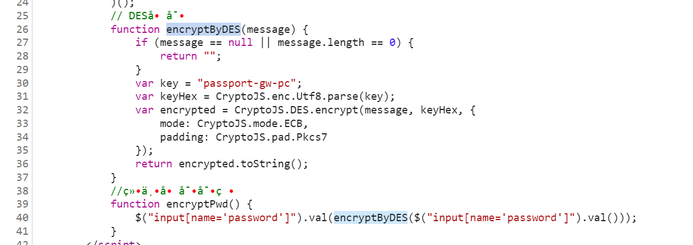

# 长虹通行证登录 

目标网址：
```
https://passport.changhong.com/login.do?view=vip&service=http://cn.changhong.com&livemode=1
```

登录的时候发送的请求中密码参数被加密了：


上面这个登录请求是提交的表单，`password`作为表单的一个参数，只能是在输入密码之后通过JS计算加密后的值进行的替换，这个替换的时间点大概率是在提交表单的时候，所以先看下表单的提交事件，然后再看下提交表单的按钮绑定的事件，追踪到是提交登录表单的按钮的单击事件绑定的一个函数`encryptPwd`： 



跟进去发现是个DES加密，key是写死在代码里的： 



本地运行一下des的ECB加密，发现值是能够与页面上对应得上的：


页面上相同密码发送的参数：


至此完毕。 
